# Yuragi

Yuragi 是一款运行在浏览器中的手写字形编辑器。绘制字形骨架后，可以调整手写变化、预览当前字库的字形排列，并导出 SVG、PNG 或书写过程动画。同一工程和种子会生成相同结果。

新访客会进入空白汉字工程。行预览按字库顺序自动显示当前工程中已保存的字形，不提供自定义预览文本。Yuragi 不提供完整字体，字形覆盖取决于用户绘制的内容；新建工程会选择汉字或拉丁排版模式。

工程保存在当前浏览器中，页面不会上传工程内容。通过 JSON 工程文件可以下载、备份和打开工程。

## 效果展示



## 快速上手



1. 在画布上绘制字形骨架并保存。
2. 保存后，字形会按字库顺序自动出现在行预览；调整全局种子查看变化。
3. 导出 SVG、PNG，或导出书写过程动画。

## 本地运行

需要 Node.js 22.12+ 和 npm 9.6.5+。

```bash
npm ci
npm run dev
```

开发服务器地址为 `http://127.0.0.1:4321`。构建静态站点：

```bash
npm run build
```

构建产物位于 `dist/`，可部署到静态托管服务。

## 数据与功能边界

- 当前工程自动保存在浏览器的本地存储中；使用工程 JSON 文件可在设备间转移。
- SVG 和 PNG 可导出单字或整行；书写动画可导出 GIF，MP4 需要浏览器支持相应的视频编码。
- 字形数据文件供回归对照使用，新建工程不会加载其中的字形。
- 新建工程在汉字和拉丁排版模式中二选一；未声明版式的旧版 JSON 仍按兼容规则读取。

## 开发检查

```bash
npm run check
npm run build
npm run parity:fixtures
npm run parity
```

`parity:fixtures` 使用 `skills/hand-glyph/scripts/` 下的 Python 程序生成对照数据；应用运行和静态构建不需要 Python。

## Agent Skill

[`skills/hand-glyph/`](skills/hand-glyph/) 是同一套手绘算法的 Python 版，打包成 agent skill，
可以让 Claude Code、Codex 等在对话里直接画手写字 SVG。它同时是上面回归对照的基准实现，
所以网页版和 skill 出来的是同一只手。

只想用这个 skill：

```bash
npx skills add Kamiyd/Yuragi@hand-glyph -g
```

手动安装、运行要求和用法见 [skills/hand-glyph/README.md](skills/hand-glyph/README.md)。

开发时装到本机（软链接到仓库里，改了立刻生效）：

```bash
ln -s "$PWD/skills/hand-glyph" ~/.agents/skills/hand-glyph
ln -s ../../.agents/skills/hand-glyph ~/.claude/skills/hand-glyph
```

其他 agent 同理，把第二行的 `~/.claude/skills` 换成对应的 skill 目录。

## 开源与许可

Yuragi 的原创程序代码和文档按根目录的 [MIT License](LICENSE) 发布，目前不单独发布为 npm 包。标志、示例素材及第三方依赖遵循各自的许可说明，详见 [素材许可说明](ASSET_CREDITS.md) 和 `package-lock.json`。

源码仓库：[github.com/Kamiyd/Yuragi](https://github.com/Kamiyd/Yuragi)
